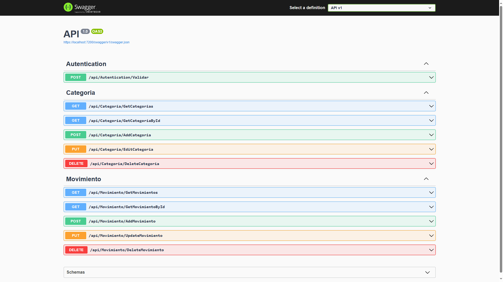

<br/>
<p align="center">
  <a href="https://github.com/arriolamatias/NetCore-Rest-API">
    
  </a>

  <h3 align="center">REST API .NET Core</h3>

  <p align="center">
    API REST desarrollada en .NET Core con Entity Framework. Cuenta con las operaciones CRUD para 2 entidades (orientadas a la gestion de finanzas personales) y autenticación mediante JWT.  
    <br/>
    <br/>
  </p>
</p>

    

## Tabla de contenidos

* [Sobre El Proyecto](#sobre-el-proyecto)
* [Desarrollado Con](#desarrollado-con)
* [Empezando](#empezando)
  * [Prerequisites](#prerequisites)
  * [Installation](#installation)
* [Uso](#uso)
* [Licencia](#licencia)
* [Autor](#autor)

## Sobre el proyecto




## Desarrollado Con


El modelo de datos se creo en un archivo .db de **SQLite** generado a partir de la metodologia _Code First_ utilizando **Entity Framework**, **LINQ** y **Fluent-Api**.

Además, utiliza **JWT** para validar peticiones y usuarios, junto con **Swagger** para la documentacion.

*Algunos ejemplos:*

* []()

## Empezando

This is an example of how you may give instructions on setting up your project locally.
To get a local copy up and running follow these simple example steps.

### Prerequisites

This is an example of how to list things you need to use the software and how to install them.

* npm

```sh
npm install npm@latest -g
```

### Installation

1. Get a free API Key at [https://example.com](https://example.com)

2. Clone the repo

```sh
git clone https://github.com/your_username_/Project-Name.git
```

3. Install NPM packages

```sh
npm install
```

4. Enter your API in `config.js`

```JS
const API_KEY = 'ENTER YOUR API';
```

## Uso

Use this space to show useful examples of how a project can be used. Additional screenshots, code examples and demos work well in this space. You may also link to more resources.

_For more examples, please refer to the [Documentation](https://example.com)_


### Creating A Pull Request

1. Fork the Project
2. Create your Feature Branch (`git checkout -b feature/AmazingFeature`)
3. Commit your Changes (`git commit -m 'Add some AmazingFeature'`)
4. Push to the Branch (`git push origin feature/AmazingFeature`)
5. Open a Pull Request

## Licencia

[](https://choosealicense.com/licenses/mit/)

## Authors

* **Matías Agustín Arriola** - *Desarrollador de Software* - [Matías Agustín Arriola](https://github.com/ArriolaMatias/)

